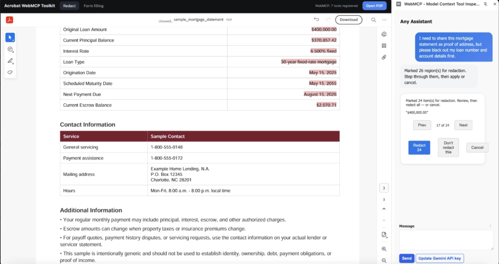
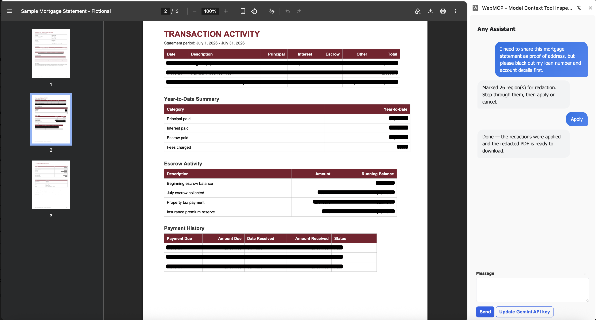
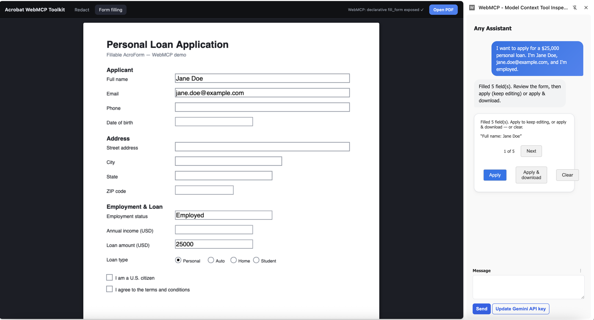
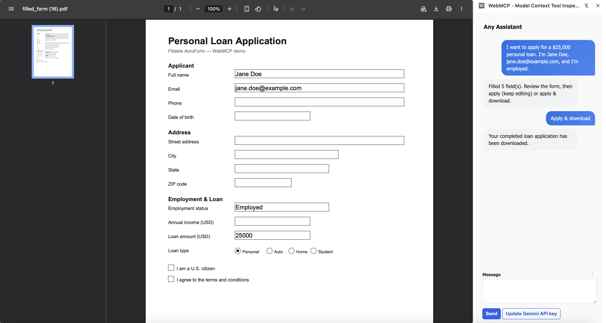

# WebMCP Acrobat Toolkit

**Let an AI agent drive real Adobe Acrobat PDF workflows — redacting and form-filling — right inside your browser, 100% client-side.**

It's built on [WebMCP](https://github.com/webmachinelearning/webmcp) (`document.modelContext`): a web page publishes its capabilities as **tools**, and any WebMCP‑aware agent can call them. Here, a Chrome extension is the *brain* (an LLM in a chat side‑panel) and the page is the *hands* (Adobe [PDF Embed API](https://developer.adobe.com/document-services/apis/pdf-embed/) + [pdf‑lib](https://pdf-lib.js.org/) + [PDF.js](https://mozilla.github.io/pdf.js/)). No backend, no uploads — **your PDF never leaves the tab.**

<!-- 📸 HERO: a short GIF of the side-panel chat driving a redaction or form-fill end to end.
     Drop the file at assets/hero.gif and it'll render here. -->


---

## What's inside

Two demos, one extension:

| | What you say | What happens |
|---|---|---|
| 🔒 **Redact** | *"redact all names and account numbers"* | The agent finds them, marks them in red, you step through and **Apply** → a flattened PDF downloads with the boxes baked in. |
| ✍️ **Form fill** | *"I'm Jane Doe, jane.doe@example.com, I'd like a $25k personal loan"* | The agent fills the PDF form field‑by‑field — and **only** with what you actually said — then you **Apply & download**. |

The magic: the same tools an AI agent calls are also wired to plain buttons, so every demo works with **or** without the extension.

### 🔒 Redact

> *"I need to share this mortgage statement as proof of address, but please black out my loan number and account details first."*

The agent reads the document, marks every match in red, and shows a review card — you step through and confirm before anything is changed.

<!-- 📸 assets/redact-review.png — the red review marks + "Marked N region(s)" card in the panel -->


Hit **Apply** and the boxes are flattened into a downloadable PDF. PDF.js finds the text, PDF Embed draws the marks — all in your browser, nothing sent anywhere.

<!-- 📸 assets/redact-applied.png — the flattened PDF with black boxes baked in -->


### ✍️ Form fill

> *"I want to apply for a $25,000 personal loan. I'm Jane Doe, jane.doe@example.com, and I'm employed."*

Describe yourself and watch the PDF populate live. The agent fills **only** the fields you actually mentioned — notice *Date of birth* and the address stay blank — then hands you a review card. It's told, firmly, **never to invent a value you didn't provide.**

<!-- 📸 assets/formfill-filled.png — form filled from the prompt + Apply / Apply & download review card -->


pdf‑lib writes each answer back **by field name** (no fuzzy guessing), and **Apply & download** flattens the completed form into a PDF.

<!-- 📸 assets/formfill-downloaded.png — the completed, downloaded PDF -->


---

## Quick start

> **Requirements:** Google Chrome **149+** with `chrome://flags/#enable-webmcp-testing` enabled (for the WebMCP agent path). The demos also render fine on their own without it.

### 1. Run a demo
Open the live demo: https://opensource.adobe.com/webmcp-acrobat-toolkit/ — a sample PDF loads automatically, with a built-in keyword box for redaction that works standalone, no extension needed.

### 2. Load the extension
<!-- 📸 Screenshot: chrome://extensions "Load unpacked" + the side panel open. → assets/extension.png -->
1. Go to `chrome://extensions` → turn on **Developer mode** → **Load unpacked** → pick the `extension/` folder.
2. Open a demo page (above) and open the extension's **side panel** on that tab.
3. Click **Set Gemini API key**, paste your own [Gemini key](https://aistudio.google.com/apikey) — that's the whole setup.

### 3. Talk to it
Type a request like the examples above and watch the agent work through the PDF. That's it. 🎉
Try prompts like:
"redact all names" or "redact the account numbers" — the agent finds matches, shows a review card to confirm before anything is applied, then redacts on approval
"fill this loan application — my name is X, email Y" (on the form-fill demo page) — the agent fills only the stated fields, shows a review card, then applies and downloads on confirmation

For form-filling, you can also upload your own PDF via the "Upload PDF" button — but it must be a fillable AcroForm (a PDF with real, named form fields), not a flat/scanned document. A sample loan-application form with AcroForm fields is loaded by default if you don't upload your own.

---

## How it works

```
┌─────────────────────┐      document.modelContext      ┌──────────────────────────┐
│  Extension (brain)  │  ───  getTools / executeTool  ─▶ │  Demo page (hands)       │
│  LLM chat sidepanel │                                  │  PDF Embed · pdf-lib ·   │
│  Gemini or gateway  │  ◀───  tool results / review  ── │  PDF.js  → real PDF ops  │
└─────────────────────┘                                  └──────────────────────────┘
```

The extension discovers whatever tools the page registers on `document.modelContext` and calls them from the chat — it never needs to know *how* a PDF gets redacted or filled, only that the tools exist. Two flavors of WebMCP are on display:

- **Imperative** — the page calls `registerTool(...)` directly (redact, and `formfill.html`).
- **Declarative** — the page injects an annotated `<form toolname="fill_form" …>` and the browser turns its fields into a tool automatically (`formfill-declarative.html`).

<details>
<summary><b>The tools each page exposes</b></summary>

| Demo | Tools on `document.modelContext` |
|---|---|
| Redact | `find_and_redact` · `get_document_text` · `redact_regions` · `goto_mark` · `skip_mark` · `apply_redactions` · `cancel_redactions` |
| Form fill | `get_form_fields` · `fill_form` · `goto_field` · `apply_form` · `download_form` · `clear_form` |

Human‑in‑the‑loop is built in: tools return a review card so you confirm before anything is written or downloaded.
</details>

---

## Configuration

**Gemini (default):** click **Set Gemini API key** in the side panel — bring your own [key](https://aistudio.google.com/apikey). Nothing else required.

**Any OpenAI‑compatible gateway (optional):** OpenAI, OpenRouter, a local LiteLLM proxy, your own endpoint — open the side panel's **⋮ → Gateway**, enter the base URL, key, and model, and **Save**. No endpoint or key is ever hard‑coded; you can also drop them in `extension/.env.json` (see `.env.json.example`, gitignored).

---

## Good to know

- 🔐 **Fully client‑side.** The page talks to no backend; the only network call is the extension → your chosen LLM. Your document stays in the browser.
- 🧪 **It's a demo/toolkit**, not a production redaction guarantee — always eyeball the output before sharing a "redacted" file.

## License

Apache‑2.0 — see [LICENSE](LICENSE), [CONTRIBUTING](.github/CONTRIBUTING.md), and [CODE_OF_CONDUCT](CODE_OF_CONDUCT.md).
